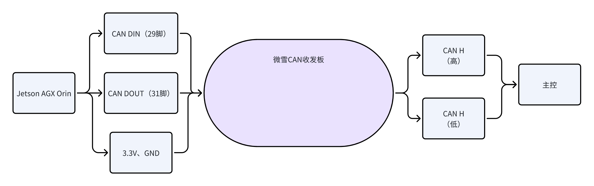

省流：

逆天厂商无法给出CAN板的开发手册，其工作逻辑和数据处理方案完全不知，导致浪费时间一个个波特率去试，而且还试不出来。最终厂商也未能给出个最终说法。

因此购买了基于PCAN的收发板，与过往Orin代码完全兼容的折中办法。

# CAN子板方案综述

一般市面上能购买的有以下三种

## 串口CAN（/dev/ttyS\*)

串口一般就是COM口。串口可以从USB转串口（CH340芯片）得到，也可以从机内某些地方引出。

CAN收发芯片从串口得到数据后，会根据设定的模式去处理串口数据，反之同理。比如有透传（给串口的数据加一个固定的ID）、包模式（自己控制整个CAN帧的内容）、ModBus等等。比如下面的透传模式的示例图，这就很清晰明了要发什么数据了。

选型示例：泥人科技的USB-CAN。上面的手册就是它家的。结构实质上是CH340+CAN收发芯片。

好处：非常简单，你只用管串口就是了。如果是从零开始我觉得不错。前提是有好的文档。

缺点：CAN帧缓存小，比如上面那个只能缓存200帧，极限情况下如果堵车了，先进先出可能会丢数据（没听到过以前有这种情况）。

## USB-CAN(/dev/USBCAN\*)

顾名思义，这一个CAN设备直接是完全的USB设备，开发时也只要往物理USB设备丢数据。

选型示例：https://github.com/SOULDE-Studio/USB2CAN\_ROS?tab=readme-ov-file

好处：这个卖家提供了很多机器人、ROS的示例，看起来很可靠。

坏处：需要它的第三方库实现与设备的通信。

## PCAN（can0、can-untils)

上赛季所用的方案。与socketCAN配合使用。因为本赛季逆天的工控机厂商，目前也打算采取这个办法。

最大的特点是直接能被识别到为can设备。很有安全感。

socketCAN是ROS官方的CAN功能包https://wiki.ros.org/socketcan\_interface?distro=noetic，需要特定厂商才能支持。其中，PCAN（也叫PEAK-CAN）就被支持。

选型示例：挺多的。注意需要带隔离的，不然按照24赛季主控哥的说法，总线芯片断电状态下会把整车can网络拉低（电压降低。虽然CAN网络依靠压差来运行，具备一定的抗干扰能力）

好处：与Orin代码完全兼容（理论上）

坏处：得有socketCAN的基础

# 背景

2025赛季更换为X86架构的工控机，CAN实现方案与Orin基本不同。

## Orin CAN方案回顾

### 硬件

https://docs.nvidia.com/jetson/archives/r35.3.1/DeveloperGuide/text/HR/ControllerAreaNetworkCan.html#controller-area-network-can

Orin的方案如下图，注意收发板，它的功能是转换为CAN H和CAN L，正是因为这个用杜邦线的板子稳定性始终是个雷，你有时候会发现主控报无人设备断联，大部分是这个原因。

在Linux下，一般can设备是归入到以太网管理的。在内核启动CAN相关模块后，就可以通过socketCAN（一个
ROS包）来向实体CAN设备通信了。

但在新工控机上，你会发现输入`ifconfig -a`，一个CAN设备都找不到。

### 软件

再介绍一下CANBus下的功能包。

canbus负责CAN帧的打包，将控制指令打包后发送到话题/sent\_messages；也接收`/receive_messages`，负责CAN帧的解析，再把从主控收到的AMI指令发到` /res_and_ami_data`，这样就知道我们按车上选模式是几了。

candriver是23赛季USB-CAN用的（也就是红CAN，也叫CAN分析仪），不用管它。

socketcan\_bridge是负责ROS域与CAN设备的部分。接收/sent\_message后就往CAN硬件发送了，也就是`topic_to_socketcan`，很直白明了吧。反之，收到CAN硬件的CAN帧后，就发到话题`/receive_messages`，也就是`socketcan_to_topic`

canload.sh是开机自启动，设置CAN设备用的，形如sudo ip link set can0 type can bitrate 500000这样的命令，就是对can0这样的硬件做更改。

很遗憾，上面除了canbus，其他东西在新工控机都没用了。新工控机连can0这样的设备都找不到，何谈用can相关的指令和包。

CANBUS中对从主控接收到的大量信息进行了处理，但其实真正有处理的不多。比如id859，856，535，537在Canbus中进行处理，但receive message里面找不到。

真正用到的只有AMI选任务517。

## 新工控机CAN方案

还记得上面说的收发板吗，这玩意现在内置到工控机里面了。

在工控机的机身上，有着两个CAN接口，它的外形是DB9，也叫RS232/RS485，它形状怎么样不要紧，因为它里面有两根针，就是CAN H和CAN L。只要这两根针接到主控，搞定。

那为什么你在新工控机上找不到CAN设备？**因为这个机内的收发板与工控机是通过串口连接的，**&#x4F60;只要往串口发CAN帧的16进制内容，收发板就会转换为CAN信号，通过那两根针出去。

很简单的原理，结果被这个黑盒子一样的收发板搞得一坨。

# CAN知识补充

1. CAN包括标准帧和拓展帧，我们的数据量只用到标准帧

2. 标准帧里我们能动的有11bit数据，这里面2bit是高低位ID，比如id=774（十进制）转换十六进制是0x306，那么这两bit就是03 06；1bit是DLC，说明后面数据的长度，比如08就是后面有8bit的数据；最后8bit就是数据了。总结：11=2+1+8

3. 高低位ID涉及到CAN中的仲裁，ID越小优先级越高。

4. （其余待补充）

# 新工控机CAN配置日志

完成serial\_send.cpp节点，它会订阅/sent\_messages然后发到串口/dev/ttyS4（对应COM5，即CAN1）也就完成了控制数据发送到串口这一步。这里可设置的有：只发送8位数据，或是按照上面说的发11位数据；然后是波特率设置，只能在9600-57600，后面我用了19200

完成serial\_receive节点，会从/dev/ttyS4接收CAN数据，然后按ID分类发送到/receive\_messages。

## 问题1：工控机发送到CAN收发仪（红CAN）得到的数据为空，红CAN发送到工控机会产生一大堆垃圾

猜想1：这DB9的CAN线线序对吗？

验证：两个红CAN通过这根线去收发，一切正常

猜想2：工控机输出的CAN帧有问题

验证：工控机两个CAN相连，CAN1发，CAN2接收，居然也正常，我草。

猜想3：CAN接口出来的波特率，按照厂商说的是19200，但是红CAN只能选择10K或者20K，是否有影响

验证：自定义波特率，需要计算十六进制。选择0x00FF004A，但问题依旧；两红CAN都设置19200，通讯正常。

猜想4：CAN与串口之间可以是19200，但是CAN接口到CAN分析仪明显不能这么低的波特率。

验证：分析仪逐挡更改波特率，比如常用的500K和1000K，问题依旧。

情况就是，波特率为19200时，分析仪发送给工控机发送一帧，id=00 03，数据为00 01 02 03 04 05 06 07，工控机串口会收到142帧相同的帧，id=0x1047，数据是10 50 64 0C 00 00 00 00；

波特率为500K等时，发送一帧，工控机会收到几十帧ID和数据都不同的帧。

